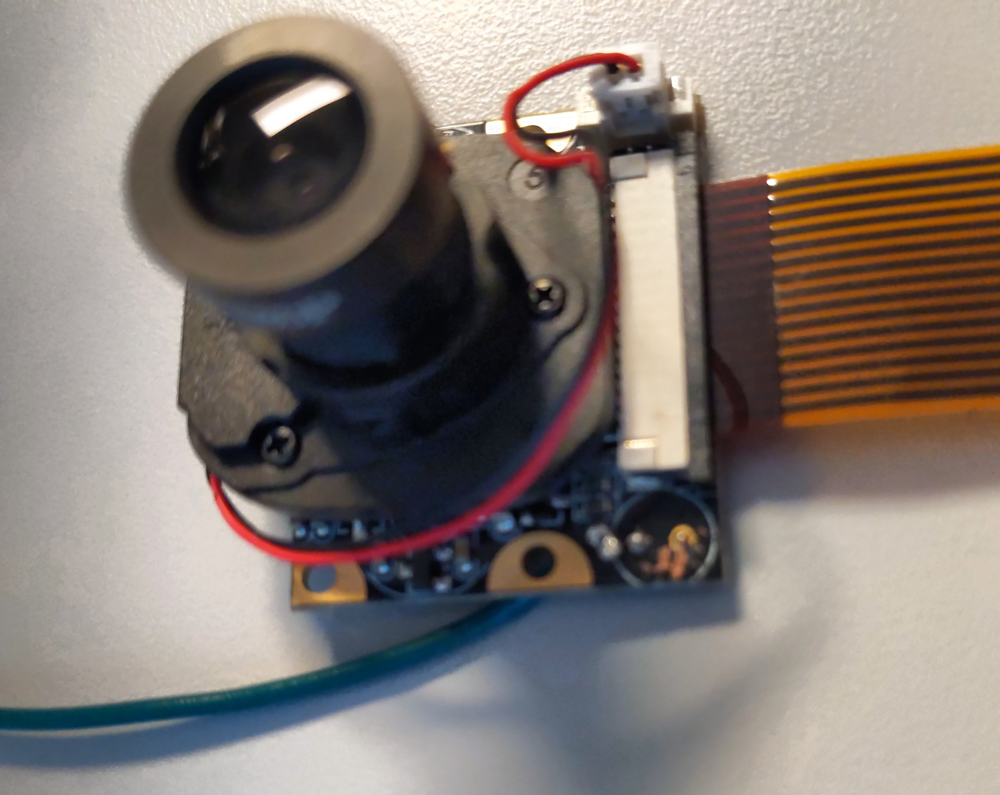
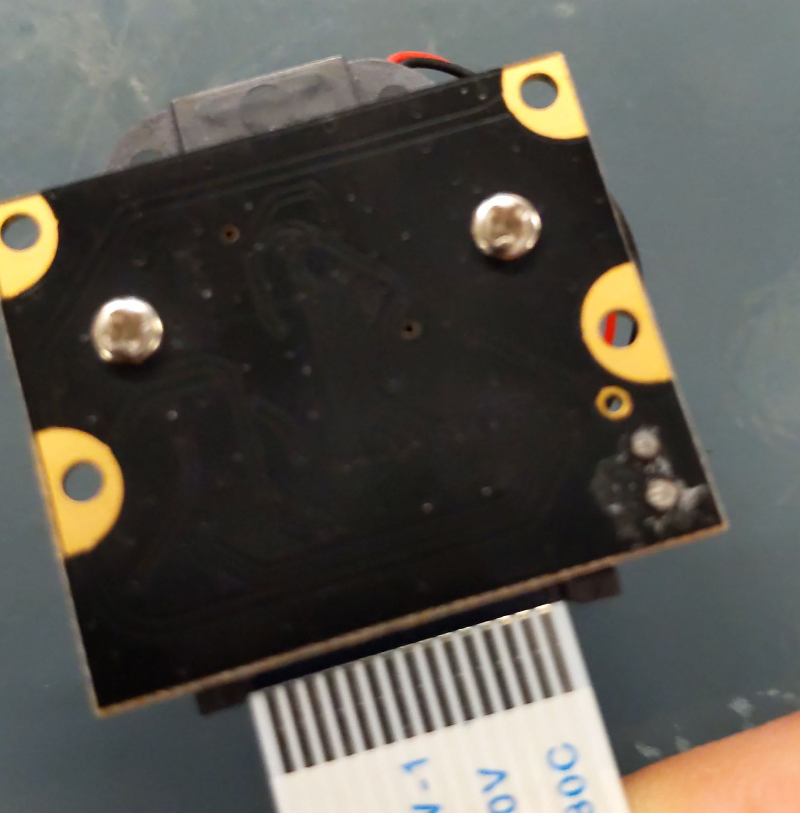
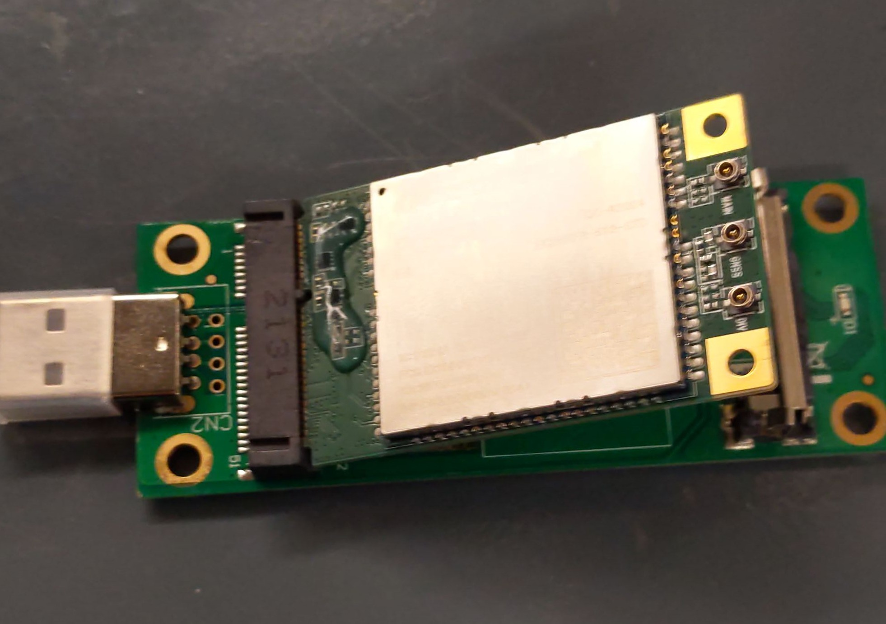
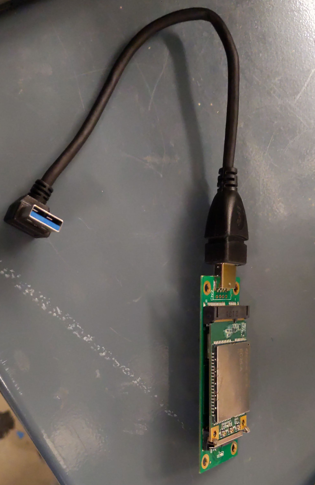

Prerequisite Knowledge:
Basic Linux, electronics, general computer troubleshooting

Helpful Resources:
Soldering: https://mightyohm.com/files/soldercomic/FullSolderComic_EN.pdf

# Build Guide

## Parts List

**WaterCam Unit**

- Raspberry Pi 4B

- [Copper or aluminum heatsink](https://www.amazon.com/GeeekPi-Heatsinks-Conductive-Electronic-Compatible/dp/B0C7Z27Q3R) for Raspberry Pi

- [Case 150x150x90 mm or larger](https://www.amazon.com/LMioEtool-Dustproof-Waterproof-Electrical-Transparent/dp/B07PK84N5D)

- [Optical Camera w/ controllable NIR filter (IR-CUT)](https://www.amazon.com/Dorhea-Raspberry-Camera-Automatic-Adjustable/dp/B07DNSSDGG/136-0027955-5919373) - should come with a ribbon cable to connect to the Pi 4B

- WittyPi 4 power management: [Witty Pi 4 HAT - RTC & Power Management for Raspberry Pi : ID 5704 : Adafruit Industries](https://www.adafruit.com/product/5704)

        Witty Pi 4 supports 3A power output for the Raspberry Pi 4

        [CR2032 Battery for WittyPi 4](https://www.adafruit.com/product/654)

- Flir Lepton 3.5 and Flir Breakout Board v2
  
  - [Flir Breakout board 2.0](https://www.mouser.com/ProductDetail/Teledyne-FLIR-Lepton/250-0577-00?qs=DRkmTr78QARne0IUCYtsyA%3D%3D)
  
  - [Flir Lepton 3.5](https://www.mouser.com/ProductDetail/Teledyne-FLIR-Lepton/500-0771-01?qs=DRkmTr78QAQNv%2FBEKfCn%252BQ%3D%3D)

- [Female/Female Jumper Wires](https://www.adafruit.com/product/266) - to connect Flir until we get a custom PCB made

- LWIR (8-14 micron range) transmission window material to protect Flir - [Edmund Optics](https://www.edmundoptics.com/f/infrared-ir-material-windows/12440/)

- [Stemma QT header cables to connect Adafruit sensors to Pi](https://www.adafruit.com/product/4397)

- plus [Stemma QT to Stemma QT cable](https://www.adafruit.com/product/4210) for chaining Adafruit sensors to other Adafruit sensors

- [Adafruit BNO085 IMU](https://www.adafruit.com/product/4754) or 055 IMU- for motion detection / orientation reporting

- [Adafruit AHT20](https://www.adafruit.com/product/4566) Temperature and Humidity Sensor - for monitoring device health

- [Voltaic V50 Battery](https://voltaicsystems.com/v50/) or V75 or other battery

        We are using Voltaic battery packs because they do not auto-shutdown during low power draw, which is important for this system as it will be in low-power mode most of the time and losing power then would prevent it from starting back up. They are intended to be directly charged from 6V solar panels using a barrel jack to usb-c (micro for older verions) adapter. If using a battery that is not always-on configure the WittyPi to draw more power when idle to avoid losing power.

- [Solar Panel](https://voltaicsystems.com/10-watt-panel-etfe/) - 6 volt panel if charging Voltaic battery pack directly  

- MicroSD card - preferably higher capacity than needed (at least 64GB), consider "high endurance" or "industrial" (for temperature tolerance) cards: https://www.dzombak.com/blog/2023/12/Choosing-the-right-SD-card-for-your-Pi.html
  
  Example: [SanDisk High Endurance microSD](https://shop.sandisk.com/products/memory-cards/microsd-cards/sandisk-high-endurance-uhs-i-microsd?sku=SDSQQNR-064G-GN6IA)
  
  Test the SD cards with F3 Fight Flash Fraud to verify they are legit: https://github.com/AltraMayor/f3

       TODO: Alternatively boot from USB SSD - this has pros/cons

* Dual USB-A to single USB-C cable to connect Voltaic power pack to WittyPi 4, preferably with right angle connectors for smaller cases. Only the USB-A ports on the Voltaic packs are always on, and each outputs 2.5A max, 3A together, so we need a Y power adapter.

* Cellular modem with USB Adapter board:
  
  [Quectel EC25 Cellular Modem](https://www.amazon.com/Quectel-LTE-EC25-AF-Mini-PCIe/dp/B082SL8KY1)
  
  [Cell Modem USB Carrier/Adapter with SIM Card Slot](https://www.amazon.com/gp/product/B07YY5967K)
  
  [Antennas for Modem and GPS](https://www.amazon.com/Antenna-698-2700MHZ-Universal-Directional-Wireless/dp/B08XBSYT8N) - need 3 antennas, 2 for cellular and 1 for GPS
  
  [Cables to connect Antennas to Cell Modem](https://www.amazon.com/Coaxial-Pigtail-Antenna-Bulkhead-Extender/dp/B098QH631G) - get appropriate cables to connect to uFL on the cellular board. SMA male antennas need SMA female cables, RP-SMA antennas likewise need the correct cables.
  
  [USB A Right Angle Up Adapter Cable for Modem](https://www.amazon.com/Antrader-Degree-Extension-Converter-Adapter/dp/B07F7Y21GW) - if the modem board does not otherwise fit in your case. The 150x150x90 case is too small to directly install the modem into the USB port on the Raspberry Pi.
  
  SIM Card for Cell Modem - 1nce for example has a data plan targeting IoT devices

* [Multitech mDot LoRa module](https://www.multitech.com/brands/multiconnect-mdot)
  
  - [Antenna for mDot](https://www.amazon.com/915MHz-LoRa-Antenna-Indoor-Cable/dp/B0CTXKBMH9) - RP-SMA connector needed on 915 MHz antenna
  
  - [Female-Female 2.54 to 2.0mm Jumper Wires](https://www.adafruit.com/product/1919) - 2mm pitch header cables for connecting mDot to Raspberry Pi until we get a custom PCB made

* Cable gland to let solar panel power cable into case
  
  **optional items we are evaluating**
- Anti-fog spray/hydrophobic coating for lens

- Desiccant packs - for example https://sensorpros.com/products/druck-dri-can-desiccant?variant=3272716801 or https://www.amazon.com/Silica-Gel-Packets-Indicating-Electronics/dp/B0B2DNLZ4K - will need to be dried for reuse
  
  **Tools and accessories - do not order multiples**

- [Conformal coating](https://www.digikey.com/en/products/detail/mg-chemicals/419D-55ML/9657990) to protect electronics from water - make sure it is not applied to any connectors

- Silicone sealant for water-resistance - use to seal holes in case

- Ethernet cable - so you can connect to a network for updates and initial configuration. I shared the WiFi connection on my laptop with the Pi over Ethernet using Network Manager's connection sharing on Linux. Other operating systems have similar functionality.

- [Serial TTL USB adapter cable](https://www.adafruit.com/product/954) - useful for logging into the Pi before networking has been configured, and for debugging/troubleshooting.

- Drill for creating openings in case for cable gland, antenna sockets (if antennas don't fit in the case or need to be external), and camera aperatures

- microSD reader if you do not have one

### Setup Raspberry Pi 4 with Flir Camera, IMU, and Quectel Cellular modem+GPS

  Refer to this image for GPIO pin numbers


Flash the current SD card image file to an unused microSD card: https://github.com/WaterCam-Team/sd-images

You can use the [Raspberry Pi Imager's](https://www.raspberrypi.com/software/) custom OS option to write the image file to a SD card. Simply click "Choose OS", scroll all the way down, select "use custom" and pick the file you downloaded, then click "Choose Storage" and pick your microSD card. You don't need to customize settings or options, just write the image - so select "No" when asked if you want to customize Once it's been written to, you can insert it in a Pi 4B and let it boot. It will automatically expand the filesystem to the full size of the card, so it will take some time on the first boot. Do not interrupt this, just let it run.

You can connect to the system using a serial cable. Once it's connected to a network (via nmtui or other) synchronize the time (manually or with wittypi.sh) and change the hostname with `sudo hostnamectl set-hostname NEWNAME`. Verify that the 127.0.0.1 entry in /etc/hosts matches this new hostname and is not still using the base image name. Then you can add the device to Tailscale with an ACL tag: go to Tailscale Admin, click "Add device", select Linux server, add an ACL tag, and generate the install script.


<details>
<summary>If and only if installing software from scratch:</summary>

Use Raspberry Pi Imager to install current stable 64-bit Raspberry Pi OS Lite (Bookworm) to a microSD card with SSH enabled in the configuration options, along with the user account name and password, and configure a unique hostname for each system that makes sense (like the installation location)

https://www.raspberrypi.com/software/

After flashing, add `enable_uart=1` at the end of the /boot/config.txt file. Insert the SD card in the Pi, attach power and boot it up.

https://www.jeffgeerling.com/blog/2021/attaching-raspberry-pis-serial-console-uart-debugging

Use a serial cable to connect to the console and use sudo raspi-config to configure the device settings (locale, timezone, predictable network names, etc.,) and select Network Manager in place of dhcpcd in networking settings.

https://learn.adafruit.com/adafruits-raspberry-pi-lesson-5-using-a-console-cable/software-installation-windows

Pi Zero: within raspi-config, leave GPU memory at the default of 32 MB, PiCamera2 will not need more and the camera will not work with less.

Use sudo nmtui to configure the ethernet connection to a static IP, with your computer IP as the gateway and DNS server if you are sharing your Internet connection with the Pi. Otherwise configure for whatever network setup you have.

Now you can use ssh to login to the Pi after connecting it to your computer with an ethernet cable. Connection sharing can be setup using Network Manager on a Linux computer, or Windows Connection sharing, or the macOS equivalent.

Once you've logged in and have an internet connection on the Pi, run `sudo apt update` and `sudo apt upgrade`

Verify the Pi is on the latest firmware with `rpi-eeprom-update`.

Helpful tools: `sudo apt install git tmux htop rpicam-apps`
Serial console application: tio [https://github.com/tio/tio] or other (screen, minicom, etc.,)
Install your preferred editor (which should be neovim) and aptitude if you want a TUI for apt

Set /boot/config.txt options:

###### Disable LEDs to save a little power

dtparam=act_led_trigger=none
dtparam=act_led_activelow=off
dtparam=pwr_led_activelow=off

To disable ethernet LEDs on Pi 3 & 4 try:

dtparam=eth_led0=4
dtparam=eth_led1=4

or:

dtparam=eth_led0=14
dtparam=eth_led1=14

###### disable audio

dtparam=audio=off

###### disable wireless - Obviously leave this out if you are using Wifi on the Pi

dtoverlay=disable-wifi
dtoverlay=disable-bt
dtoverlay=pi3-disable-wifi
dtoverlay=pi3-disable-bt

###### I2C clock stretching for BNO055 IMU - only set this if there are issues with the BNO IMU

dtparam=i2c_arm_baudrate=10000

###### Pi Zero: add to /boot/cmdline.txt - Flir Lepton SPI settings

spidev.bufsiz=131072

###### SD Card settings

Disable swap and set noatime to prolong SD card life by decreasing writes: `sudo swapoff --all`, `sudo apt purge dphys-swapfile`.

Add `noatime,commit=60` settings to ext4 partitions in /etc/fstab - noatime prevents writing access times to files, commit collects and delays writes to every N seconds. Data loss will be limited to the last N seconds of writes if power is lost. Do NOT change the /boot partition settings, it is a vfat filesystem and these options will not work and will cause the Pi to not boot.

Set temp directories like /tmp to mount in RAM, ex. `tmpfs /tmp tmpfs nodev,nosuid,size=20M 0 0` in fstab: https://wiki.archlinux.org/title/Tmpfs

Other options include logging to a USB drive, or setting the SD to write-protected and using a USB drive for all write operations.

Use a larger SD card size than needed so you have free space for automatic wear-leveling (is this a thing on cheap SD cards?) 

Industrial or "high endurance" cards should offer better durability. SLC flash would be ideal but is expensive.

##### Optional Tweaks

You can disable services we won't be needing to speed up boot slightly (~3s)
sudo systemctl disable man-db.timer keyboard-setup triggerhappy

If you are not using wifi you could also disable wpa_supplicant

Outdated (Bullseye specific): If there are issues with taking high-resolution images use the vc4-kms-v3d driver with options: dtoverlay=vc4-kms-v3d,cma-320

Can also add nohdmi to the vc4-kms-v3d line to disable HDMI ports and save ~30mA

### Power Management

Next, configure the WittyPi 4 for power management.
Download: wget http://www.uugear.com/repo/WittyPi4/install.sh
Install: sudo sh install.sh
Shutdown the Pi, install the WittyPi onto the Pi using the extended headers
Reboot, then run wittyPi.sh from the wittypi directory to configure the schedule.

Install doas with `sudo apt install doas -y`

Create /etc/doas.conf and add:

`permit nopass <username> cmd reboot
permit nopass <username> cmd shutdown`

We will run `doas shutdown` to power down the Pi in a script that is run as a non-root user. This lets us save power by turning off the Pi after it has completed its tasks and we can turn it back on at a regular interval with the WittyPi schedule.

Remove uwi since we will not be using it: sudo systemctl disable uwi, then rm the uwi directory.

If there are issues with power management check the firmware version the WittyPi is using and upgrade if needed using these instructions (might need a Pi with Bullseye installed, worked for me on Bookworm with kernel 6.1): https://www.uugear.com/portfolio/compile-flash-firmware-for-witty-pi-4/#rtc_offset_value

Remember to save and restore the clock offset as the instructions say.

### SU-WaterCam software setup from scratch

Clone the public git repo: https://github.com/mandeeps/SU-WaterCam.git
Compile lepton.c and capture.c for the device. Install build-essential if not already done: `sudo apt install build-essential`. Then cd to the SU-WaterCam/tools directory and run: 
`gcc lepton.c -o lepton && gcc capture.c -o capture`

Copy to the root of the SU-WaterCam directory: From tools directory, run `cp lepton ../.` and `cp capture ../.`

Use apt to install these packages: `sudo apt install libgpiod-dev python3-pandas python3-dev python3-venv exempi python3-wheel python3-picamera2 python3-rasterio python3-gdal python3-pygraphviz python3-opencv`

Make sure picamera2 is installed as system package, not through pip

Create a virtual environment with `python -m venv --system-site-packages /home/pi/SU-WaterCam/venv`, (we use system-site-packages to copy over pandas and other installed modules)
activate with `source /home/pi/SU-WaterCam/venv/bin/activate`, and then install modules with `pip install -r /home/pi/SU-WaterCam/requirements.txt`
or manually with `pip install compress_pickle adafruit-blinka gpiozero piexif py-gpsd2 python-xmp-toolkit` and other contents of requirements.txt

Set default Python to the venv by adding 'source /home/pi/SU-WaterCam/venv/bin/activate' to the end of your .bashrc file.

### Adafruit BNO055 IMU

`pip install adafruit-circuitpython-bno055` in the venv

### Adafruit BNO085 IMU

`pip install adafruit-circuitpython-bno08x` in the venv

### Calibrate the IMU prior to use:

TODO add instructions

Calibrate BNO055

Calibrate BNO085

</details>

## Hardware Setup

Current order of installation:

Modify NIR camera, install passive heatsink, install WittyPi 4 with CR2032 battery, connect NIR camera, connect cellular modem, connect Flir Lepton, connect mDot, insert microSD card, power on and test device before installing into case.

Drill holes for cameras and external power (and antennas if too large to fit within or signal blocked) into case, place components and battery into case, install cameras, connect antennas. Power on and test device.

Apply silicone sealant to all openings into case, and install LWIR transmission window for Lepton. Check water-resistance before field installation. Connect to solar panel power.

### Optical Camera

Remove the photo resistor (light sensor) from the Dorhea IR-CUT camera. You could remove it by snipping the two leads that connect it to the board, or apply heat with a soldering iron to the two leads and use a solder sucker or solder wick to detach them. 

Solder a wire so the IR filter can be manually controlled by the Pi. The wire is soldered to the third point from the bottom of the camera on the backside and connected to pin #40 on the Pi for use with the take_nir_photos.py script.

Before removing the photoresistor:


Solder a header cable like so:


It should look like this when done, the light sensor is gone and the wire will let us manually control the filter:



Insert the cable into the camera with the metal pins facing the board:



On the Rapsberry Pi find the CAMERA slot. The other end of the ribbon cable should be installed with the metal pins facing away from the black plastic retainer towards the pins in the slot:


### WittyPi 4 Setup

Software is already configured on the SD filesystem image. If installing from scratch follow installation instructions for the WittyPi software before installing the WittyPi hardware. Install the heatsink, standoffs, and connect the camera ribbon cable before placing the WittyPi on the GPIO pins. Screw down the hardware so it stays attached. Create a startup script or SystemD service to run the WittyPi network time synchronization when networking is available to get an accurate system time - WittyPi stock software disables Chrony, systemd-timesyncd, etc.,


Do not forget the standoffs or the heatsink.


### Quectel EC25 Modem and GPS

Install the miniPCIE card into the USB adapter. The mini PCIE card is the component on top and the USB adapter is the component on the bottom of this image:


The card can only fit into the adapter one way:



The MAIN and DIV UFL ports should connect to cellular antennas using UFL to SMA cables, and the GNSS slot is for a GPS antenna. Read this before connecting anything to UFL connectors: [Three Quick Tips About Using U.FL - SparkFun Learn](https://learn.sparkfun.com/tutorials/three-quick-tips-about-using-ufl/all)

The UFL connectors on the cables can be easy to damage, consider using a tool like this for installing and removing the cables: [U.FL Push/Pull Tool](https://www.sparkfun.com/u-fl-push-pull-tool.html)


Use a right-angle USB adapter cable to make connecting to the Raspberry Pi easier:



Also consider taping or otherwise securing the connections once everything is installed in the waterproof case to reduce the chance of disconnections during field installation.

Some of our cellular antennas use SMA connectors. Going forward we will stick with RP-SMA because that is what the mDot uses.

 https://store.rokland.com/blogs/news/connectors-101-rp-sma-vs-sma


SMA connectors

<details>

<summary>Cellular Modem Manual Software Setup</summary>

`sudo apt install gpsd gpsd-clients`

Remove and purge udhcpcd and openresolv: `sudo apt purge udhcpcd openresolv`
Reconfigure current network devices with network manager to retain local networking during setup - `sudo nmtui` is easiest way
Make sure /etc/network/interfaces has no references to devices you want NM to manage

Then configure the cellular modem and verify everything works as expected after restarts
`sudo mmcli -m 0 --simple-connect='apn=iot.1nce.net'` Replace apn as appropriate

Setup connection with NetworkManager: `sudo nmcli c add type gsm ifname cdc-wdm0 con-name Quectel apn iot.1nce.net`

On Bookworm:
`sudo mmcli -m 0 –-location-enable-gps-unmanaged` -- to tell ModemManager to start the GPS on the Quectel EC25 but not control it, so gpsd can manage it instead
Enable gps.service in the git config directory so this will be done automatically on boot.

Bullseye: ModemManager on Bullseye doesn't support --location-enable-gps-unmanaged for the Quectel EC25 apparently, and since RaspberryPi OS has not officially released a Bookworm-based version yet, we are using Bullseye and working around this by creating a custom Udev rule to tell ModemManager to ignore the GPS:

create file /etc/udev/rules.d/77-mm-quectel-ignore-gps.rules
with contents: ATTRS{idVendor}=="2c7c", ATTRS{idProduct}=="0125", SUBSYSTEM=="tty", ENV{ID_MM_PORT_IGNORE}="1"

Save this and run sudo udevadm control --reload

sudo udevadm trigger

If using a different cellular modem change the ids to the appropriate ones, use lsusb to lookup the ids.

Reduce the priority of the cellular modem so Ethernet is preferred while you are building the unit and still installing updates: https://superuser.com/a/1603124

`sudo nmcli con mod Quectel ipv4.route-metric 100` and do the same for ipv6

Might need to reboot before next step...

Activate the GPS and enable autostart for future use -

install minicom if not already available and run it:
minicom -b 9600 -D /dev/ttyUSB2

(ttyUSB2 is the AT port for the Quectel. ttyUSB1 is the GPS output port)

In minicom, issue the following AT commands -

Enable NMEA:
AT+QGPSCFG="nmeasrc",1

Enable Autostart:
AT+QGPSCFG="autogps",1

Turn GPS on:
AT+QGPS=1

Assisted location fix:
AT+QGPSXTRA=1

Quit minicom with ctrl-a, x
These should be saved to the device's NVRAM so this should only need to be done once.

Now edit /etc/default/gpsd to set the correct gps device, in this case /dev/ttyUSB1

Then in python we can get gps data with py-gpsd2:
import gpsd2
gpsd2.connect()
packet = gpsd2.get_current()
print(packet.position())

If there are issues getting a fast location fix try updating the XTRA assist data by downloading a new xtra2.bin from xtrapath4.izatcloud.net/xtra2.bin and uploading it to the modem with sudo mmcli -m 0 --location-inject-assistance-data=xtra2.bin

sources:
https://sigquit.wordpress.com/2012/03/29/enabling-gps-location-in-modemmanager/
Stackoverflow mirror: https://code.whatever.social/questions/6146131/python-gps-module-reading-latest-gps-data

</details>

### Flir Lepton Breakout board wiring


Image source: [Lepton/docs/RaspberryPiGuide.md at main · FLIR/Lepton · GitHub](https://github.com/FLIR/Lepton/blob/main/docs/RaspberryPiGuide.md)

Eventually we will have a PCB to connect the Lepton breakout board and Raspberry Pi.

Manual Lepton Breakout Board Wiring
Orient the back of the breakout board towards yourself. The front is the side with the socket for the Lepton camera.
Let's call the pins that are closest to you pins 1 through 10, starting from the left and going to the right. Right is the side with the mini ZIF connector on top (the white plastic bit above the QR code sticker)
Let's call the pins on the bottom (away from you) pins A through J.


Image by Kaitlyn Gilmore (https://github.com/kmgmore)

We can use the top pin of the two pins without jumpers on the back of the board (side towards you right now) for ground. In other words, the pin with nothing covering it that is closest to the white ZIF socket towards the top is the ground pin, so connect it to the ground pin on the Pi.

Wiring diagram: 


Note: I2C is not required for getting data from the Lepton, but is useful for changing its configuration. Because we need I2C for other peripherals, use splitter cables for the two I2C pins (SDA and SCL) on the Pi. So get or make two cables that each have a female header on one end and a male and female header on the other end. One female end connects to a pin on the Raspberry Pi GPIO header, and the other two ends are for the Flir breakout board and a peripheral like the Adafruit IMU. Another pair of split cables is useful for 3.3V (or 5V) and ground.

Split Y cables for I2C or power: 

If using I2C: The SDA pin on the Pi (pin #3) will connect to pin C on the breakout board (side away from you) - use a splitter

I2C: The SCL pin on the Pi (pin #5) will connect to pin 4 on the breakout board (side towards you) - use a splitter - image has been corrected to match this

MOSI on the Pi (pin #19) connects to pin E on the breakout

MISO on the Pi (pin #21) connects to pin 6 on the breakout board

CLK pin on the Pi (pin #23) will connect to pin D on the breakout

CS pin (pin #24, right across from CLK, aka CE0, GPIO 8) connects to pin 5 on the breakout board

We are not using this but I am leaving the note here for reference: the VSYNC pin is Pin #11, GPIO 17 on the Pi connected to pin H on the breakout board - This GPIO is also used by the WittyPi 4 and that might cause an issue. Our software does not currently use vsync anyway, so this can be ignored.

Reset pin on the breakout is pin I following the convention declared above. Connect it to an arbritrary GPIO pin on Pi that is set high by default (options are 0-8)

I am using GPIO 6 (pin 31 on the Pi) in the lepton_reset.py script. We need a pin that is high by default because the breakout board reset triggers on low.

Insert the Flir camera into the breakout board.
Check everything is correct by running the capture and lepton binaries in SU-WaterCam. Rename or copy the appropriate 32 or 64-bit binaries to "lepton" and "capture" and then run: ./capture

Examine the created files to verify things are working.

Binaries are from https://github.com/lukevanhorn/Lepton3

Thanks Luke Van Horn! Also, thanks to Max Lipitz for the tip about the output containing the temperature values in degrees Kelvin.

#### Leptonic for live thermal image stream

We're setting up an unused Pi 3 for collecting thermal images for coregistration - using leptonic from github, a forked branch that can be built on Debian 12 Bookworm

https://github.com/rob-coco/leptonic/tree/bookworm-update

checkout the bookworm-update branch, compile that after installing dependencies: libzmq3-dev

Port forward, first ssh into pi and run leptonic on /dev/spidev0.0, then open another terminal and port forward with:
➜ ssh -L 5555:10.42.0.3:5555 pi@10.42.0.3

Run the leptonic web server on your own machine, it's too much for the Pi 3 to do both: 
npm start in frontend directory then
127.0.0.1:3000 in your browser

</details>

### Multitech mDot LoRa module


The default mDot firmware is set up for UART. The WittyPi can tell if the Raspberry Pi is off by reading the TX pin, which should be set low when the Pi shuts down. Keeping the mDot powered on through the WittyPi keeps the TX pin on the Pi set high and prevents the WittyPi from cutting off power to the Raspberry Pi. So we turn on alternative UART pins on the Pi 4B and use those to connect to the mDot instead on our default OS images.

To do this manually: add dtoverlay=uart5 to /boot/config.txt on a Pi 4 so we can use pin 32 for TX and pin 33 for RX. On the Pi 4, make sure "enable_uart=1" is in the /boot/config.txt file, and add "dtoverlay=uart5". Save and reboot. Connect the TX pin on the mDot to pin #33 on the Pi and connect the RX pin on the mDot to pin #32 on the Pi.

**mDot wiring**

The power pin (VOD, pin # 1) on the mDot should be connected to 3.3V on the WittyPi. Connect ground (pin 10 on the mDot) to the ground pin on the WittyPi. Connect the mDot UART TX (transmit, pin #2) to the Pi RX (receive) pin (pin #33 if using uart5), and the mDot RX pin (#3) to the Pi TX pin (pin #32 using uart5).


For the remote start over Lora function, the WittyPi ground should be connected to both the mDot ground and a mosfet's source. The mosfet drain should be connected to the WittyPi switch pin. The mosfet gate should be connected to both the mDot output pin PB_1 and the WittyPi ground with a resistor. The mDot input pin PA_6 should be connected to a GPIO on the Raspberry Pi that is set HIGH when the Raspberry Pi is turned on, we are using GPIO 5 (pin 29) on the Raspberry Pi. 


On the Pi run tio /dev/ttyAMA1 and issue AT commands to control the mDot, see the mDot AT reference document in the instructions directory. For example, "ATI" will tell you the installed firmware version.

if using minicom or screen:

sudo minicom -s -D /dev/serial0 to connect to the mDot if it is on the default TX/RX pins, minicom -s -D /dev/ttyAMA1 if on uart5,

Use the settings specified in the mDot manual:

Baud rate 115200

Data bits 8

Parity N

Stop bits 1

Hardware/software flow control off

For deployment we'll want the mDot to have a separate power source so we can remotely trigger it to signal the WittyPi to boot up the system and record data. This will require routing power directly from the WittyPi 4 using the unpopulated 7 pin header on the WittyPi to the mDot, connecting a GPIO pin on the mDot to a mosfet which triggers the WittyPi switch pin, and modifying the firmware so this can be triggered with a LoRa packet.

### Solar Power

Voltaic battery packs should be connected to solar panels using the connector on the side of the battery pack. Older models used micro-USB and newer ones use USB-C. The USB-C port on the top can be used for reading the battery level. The full-size USB-A ports are the ones that provide always-on power. Voltaic packs support pass-through charging from solar panels.

According to Voltaic: "The SBU pins still correlate to ½ of the cell voltage, so while the battery cell voltage ranges from approximately 3.2V (empty) to 4.2V (full charge), the corresponding SBU pin voltage ranges from 1.6V to 2.1V. We recommend that customers currently reading the cell voltage from the D+ pin make the necessary hardware changes to read from the A8/B8 SBU pins."

### Tailscale for remote login over cellular data

https://tailscale.com/download

Consider using Tailscale SSH: https://tailscale.com/kb/1193/tailscale-ssh

`tailscale up --ssh`

Make sure the device is [tagged](https://tailscale.com/kb/1068/tags) and not using a personal Tailscale account. See tailscale-acl.txt in config directory for an example of Access Control List rules to permit SSH into tagged devices. Forbid tagged devices from accessing other tagged devices for security. 

Do not clone SD cards from Pis with Tailscale already configured so you can install that SD card on a new Pi. Each device should be connected to Tailscale individually and not share keys.

Consider installing and using mosh for high-latency cellular connections
sudo apt install mosh

Use an appropriate client for your own device.

### Filebrowser remote file access

Helpful when using a system interactively for data collection: https://github.com/filebrowser/Filebrowser

Install, then run:

```
filebrowser config init 
filebrowser users add USER PASSWORD
filebrowser config set --address 0.0.0.0
```

Then you can create a SystemD service like the example in the config directory. Move it to /etc/systemd/system, run `sudo systemctl daemon-reload` and `sudo systemctl enable --now filebrowser` to run.

### Remote Video Streaming

with libcamera-apps-lite installed run:

`libcamera-vid -t 0 --inline --listen -o tcp://0.0.0.0:8888`

On your machine connected to the Pi (over Tailscale or directly) use VLC to stream the video using 'open network stream' and enter tcp/h264://PI_ADDRESS_OR_HOSTNAME:8888 with the appropriate IP address and port number. 

### Pytorch

`pip install torch torchvision` (in the venv)

old model based on FloodNet data set and DeepLab
FloodNet: https://ieeexplore.ieee.org/document/9460988

## Clone SD Card

If you need to clone/copy a Pi microSD card:

on a Linux/*nix system use dd to copy the entire device. Make sure you have enough free space first. Use lsblk to determine the location of the SD card! Clone the entire disk, not a partition.

`sudo dd bs=4M if=/dev/mmcblk0 of=sd_clone conv=fsync status=progress`

You might need to run dd with sudo if your user account does not have access to the SD device. Change the owner of the new file if so.

If you only want the image as a backup, want to share it online, or won't be flashing new SD cards with it for a while, use PiShrink to save some space: https://github.com/Drewsif/PiShrink

`sudo pishrink.sh -a -Z image_file`

For creating new SD cards with the file you copied use dd as above but with the input and output reversed to write to a blank SD card. ALWAYS check you are writing to the correct device when you use dd. For more information on this: https://www.pragmaticlinux.com/2020/12/how-to-clone-your-raspberry-pi-sd-card-in-linux/ 

## Manual Data Collection

If you need to take a unit out in the field to collect data you can add a couple of wires to a button to trigger the cameras and use the button-service-gpiozero.py script with GPIO Zero installed: https://github.com/gpiozero/gpiozero 

We are using a simple pushbutton on a perfboard with two header cables connected to pin #29 and ground on the Pi. Autostart the script with systemd using the button.service file in the config directory. Copy the button.service file to /etc/systemd/system, then run sudo systemctl daemon-reload, sudo systemctl enable button.service, and sudo systemctl start button.service

***References and Helpful Resources***

**Raspberry Pi**

https://pinout.xyz/

**Flir Lepton**

Lepton 3.5 with radiometery: 56° HFOV, 71° diagonal (f/1.1 silicon doublet)

[Home · groupgets/LeptonModule Wiki · GitHub](https://github.com/groupgets/LeptonModule/wiki)

[Flir Lepton Thermal Camera Breakout | Hackaday.io](https://hackaday.io/project/3000-flir-lepton-thermal-camera-breakout)

[GitHub - maxritter/diy-thermocam: A do-it-yourself thermal imager, compatible with the FLIR Lepton 2.5, 3.1R and 3.5 sensor with Arduino firmware](https://github.com/maxritter/diy-thermocam)

[GitHub - themainframe/leptonic: A web GUI and several utilities for working with FLIR® Lepton® 3 LWIR camera modules.](https://github.com/themainframe/leptonic)

[Flir Lepton hacking](https://www.electricstuff.co.uk/lepton.html)

[GitHub - groupgets/LeptonModule: Code for getting started with the FLIR Lepton breakout board](https://github.com/groupgets/LeptonModule)

[FLIR Lepton Hookup Guide - SparkFun Learn](https://learn.sparkfun.com/tutorials/flir-lepton-hookup-guide)

[Lepton/docs/RaspberryPiGuide.md at main · FLIR/Lepton · GitHub](https://github.com/FLIR/Lepton/blob/main/docs/RaspberryPiGuide.md)

https://groups.google.com/g/flir-lepton?pli=1

[GitHub - alexanderdyson/openmv_flir_object_detection](https://github.com/alexanderdyson/openmv_flir_object_detection)

[GitHub - danjulio/lepton: Code and libraries to use a FLIR Lepton Thermal Imaging Camera Module](https://github.com/danjulio/lepton/)

[lepton/raspberrypi at master · danjulio/lepton · GitHub](https://github.com/danjulio/lepton/tree/master/raspberrypi)

https://anthony.lepors.fr/raspi-thermo-cam/installation-de-leptonmodule/

https://www.pureengineering.com/projects/lepton

[GitHub - lukevanhorn/Lepton3: Lepton 3 for the Raspberry Pi](https://github.com/lukevanhorn/Lepton3)

**UUGear WittyPi4**

Alternative implementation using more standard modern Linux subsystems: https://github.com/trackIT-Systems/wittypi4 - will investigate later
Python interface to WittyPi4: https://github.com/Eagleshot/WittyPi4Python

Note that the stock software disables network time sync software like Chrony, systemd-timesyncd, ntpd, etc.,

**Multitech mDot LoRa module**

https://os.mbed.com/cookbook/Interfacing-with-Python

https://os.mbed.com/cookbook/Interfacing-Using-RPC

With mbed being EoL'd by ARM, consider mbed community edition for future work: https://github.com/mbed-ce

GCC ARM toolchain can be used for mbed in place of ARM CC

**Voltaic Battery**

["The two USB-A ports function the  same. Connecting a USB-A cable activates a mechanical switch, which puts the battery into Always On mode. Removing the cable puts that battery into Auto Off mode. If you supply power into the battery via the top USB-C PD port, the Always On function of the USB-A ports is deactivated. We recommend using the side port for power input in any Always On application."](https://blog.voltaicsystems.com/updated-usb-c-pd-and-always-on-for-v25-v50-v75-batteries/)

**Quectel Cellular Modem**

**IR CUT Camera**

Our (OV5647 sensor) camera stats: 

CCD size: 1/4 inch

Aperture(F): 1.8

Focal Length: 3.6 mm (adjustable)

Field of View: 72 degrees
